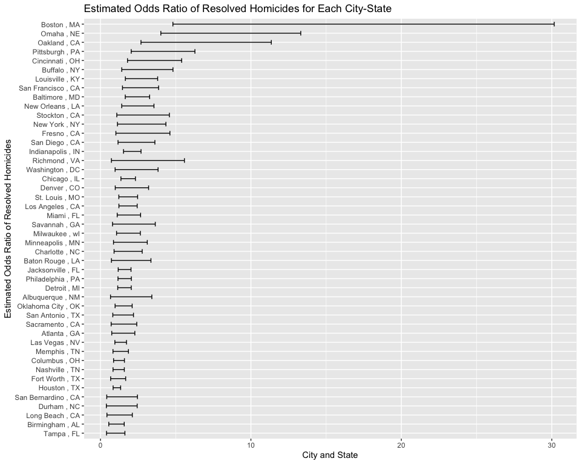
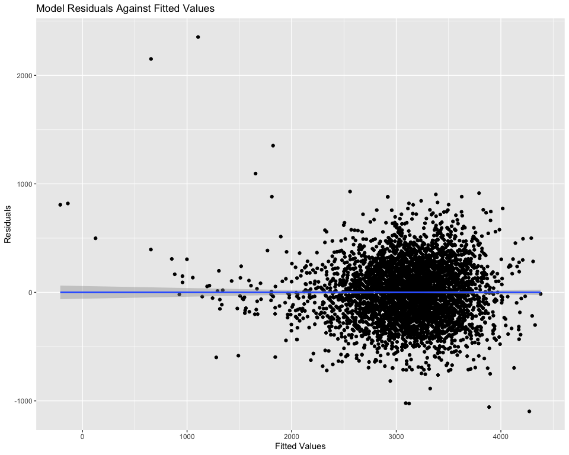
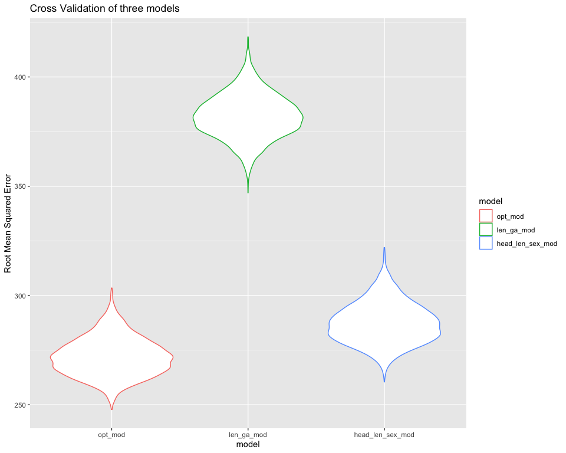
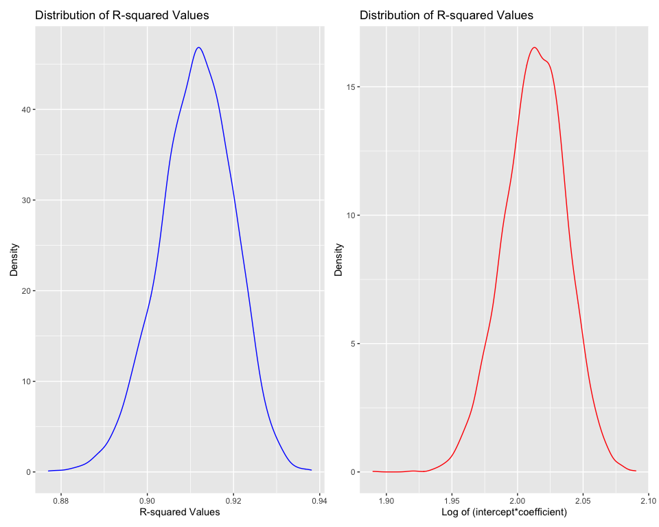

hw\_6
================
Qetsiyah Wang
12/9/2020

# Problem.1 Homicide Dataset

### Tidy dataset

``` r
homicide = read_csv("homicide-data.csv") %>%
  mutate(
    city_state = paste(city,",", state),
    resolved = as.numeric(disposition == "Closed by arrest"),
    victim_age = as.numeric(victim_age),
    victim_sex = as.factor(victim_sex)
  ) %>%
  filter(city !=  "Dallas" & city != "Phoenix" & city != "Kansas city" & city != "Tulsa") %>%
  filter(victim_race == "White" | victim_race == "Black") %>%
  mutate(
    victim_race = as.factor(victim_race),
    resolved = as.factor(resolved)) %>%
  filter(!is.na(victim_age)) %>%
  select(city_state, victim_race, victim_age, victim_sex, resolved)
```

### Logistic regression for Baltimore

``` r
baltimore = homicide %>%
  filter(city_state == "Baltimore , MD") %>%
  glm(resolved ~ victim_age + victim_race + victim_sex, data = ., family = "binomial")

baltimore_or = baltimore %>%
  broom::tidy() %>%
  mutate(
    or = exp(estimate),
    lwr_confint = exp(confint(baltimore)[1:4]),
    upr_confint = exp(confint(baltimore)[5:8])
  ) %>%
  select(term, or, lwr_confint, upr_confint) %>%
  filter(str_detect(term, "White"))

knitr::kable(baltimore_or)
```

| term              |       or | lwr\_confint | upr\_confint |
| :---------------- | -------: | -----------: | -----------: |
| victim\_raceWhite | 2.320439 |     1.649627 |     3.275933 |

Odds ratio for Baltimore comparing non-white victims to white victims
are shown in the table above.

``` r
odds_ratio = homicide %>%
  nest(data = - city_state) %>%
  mutate(
    models = map(data,
                 ~ glm(resolved ~ victim_age + victim_race + victim_sex, data = .x, family = "binomial")),
    results = map(models, broom::tidy) ) %>%
  select(-models, - data) %>%
  unnest(results) %>%
  filter(str_detect(term, "White"))

sample_size = count(homicide, city_state)
  
odds_ratio = odds_ratio %>%
  mutate(
    n = pull(sample_size, n),
    or = exp(estimate),
    lwr = exp(estimate - 1.96*std.error),
    upr = exp(estimate + 1.96*std.error)
  ) %>%
  select(city_state, or, lwr, upr) %>%
  mutate(city_state = fct_reorder(city_state, or)) %>%
  arrange(-or)

knitr::kable(odds_ratio)
```

| city\_state         |         or |       lwr |       upr |
| :------------------ | ---------: | --------: | --------: |
| Boston , MA         | 12.0492755 | 4.8137737 | 30.160338 |
| Omaha , NE          |  7.3091273 | 4.0126475 | 13.313739 |
| Oakland , CA        |  5.5300891 | 2.6927542 | 11.357102 |
| Pittsburgh , PA     |  3.5803156 | 2.0417695 |  6.278211 |
| Cincinnati , OH     |  3.1140094 | 1.7969050 |  5.396532 |
| Buffalo , NY        |  2.6107182 | 1.4141457 |  4.819765 |
| Louisville , KY     |  2.5079931 | 1.6544408 |  3.801907 |
| San Francisco , CA  |  2.3776239 | 1.4627600 |  3.864677 |
| Baltimore , MD      |  2.3204389 | 1.6475885 |  3.268071 |
| New Orleans , LA    |  2.2411315 | 1.4121937 |  3.556644 |
| Stockton , CA       |  2.2291738 | 1.0845772 |  4.581708 |
| New York , NY       |  2.2161577 | 1.1291940 |  4.349434 |
| Fresno , CA         |  2.1743570 | 1.0240934 |  4.616599 |
| San Diego , CA      |  2.0547782 | 1.1672086 |  3.617274 |
| Indianapolis , IN   |  2.0320581 | 1.5314589 |  2.696292 |
| Richmond , VA       |  2.0146684 | 0.7273429 |  5.580434 |
| Washington , DC     |  1.9306598 | 0.9735511 |  3.828712 |
| Chicago , IL        |  1.7778771 | 1.3598740 |  2.324368 |
| Denver , CO         |  1.7725435 | 0.9819675 |  3.199607 |
| St. Louis , MO      |  1.7368579 | 1.2210733 |  2.470511 |
| Los Angeles , CA    |  1.7290361 | 1.2250358 |  2.440391 |
| Miami , FL          |  1.7221979 | 1.1116667 |  2.668035 |
| Savannah , GA       |  1.7075375 | 0.8003852 |  3.642851 |
| Milwaukee , wI      |  1.6835723 | 1.0693049 |  2.650708 |
| Minneapolis , MN    |  1.6418503 | 0.8662601 |  3.111851 |
| Charlotte , NC      |  1.5839222 | 0.9041817 |  2.774674 |
| Baton Rouge , LA    |  1.5638163 | 0.7287729 |  3.355670 |
| Jacksonville , FL   |  1.5472902 | 1.1791135 |  2.030429 |
| Philadelphia , PA   |  1.5461125 | 1.1642167 |  2.053281 |
| Detroit , MI        |  1.5319985 | 1.1471577 |  2.045943 |
| Albuquerque , NM    |  1.5099537 | 0.6676735 |  3.414783 |
| Oklahoma City , OK  |  1.4313660 | 0.9720306 |  2.107762 |
| San Antonio , TX    |  1.3415257 | 0.8198957 |  2.195025 |
| Sacramento , CA     |  1.3086710 | 0.7099378 |  2.412352 |
| Atlanta , GA        |  1.3083441 | 0.7493451 |  2.284347 |
| Las Vegas , NV      |  1.2870649 | 0.9573147 |  1.730399 |
| Memphis , TN        |  1.2428125 | 0.8305440 |  1.859724 |
| Columbus , OH       |  1.1778072 | 0.8710266 |  1.592638 |
| Nashville , TN      |  1.1500629 | 0.8341066 |  1.585702 |
| Fort Worth , TX     |  1.0649408 | 0.6770281 |  1.675113 |
| Houston , TX        |  1.0622728 | 0.8409803 |  1.341795 |
| San Bernardino , CA |  1.0132871 | 0.4177310 |  2.457923 |
| Durham , NC         |  0.9769930 | 0.3912277 |  2.439795 |
| Long Beach , CA     |  0.9529378 | 0.4290118 |  2.116702 |
| Birmingham , AL     |  0.9342297 | 0.5525789 |  1.579476 |
| Tampa , FL          |  0.8091334 | 0.4029222 |  1.624871 |

``` r
odds_ratio %>%
  ggplot(aes(x = city_state, y = or, ymin = lwr, ymax = upr)) +
  geom_errorbar(width = 0.5) +
  coord_flip() +
  labs(
    title = "Estimated Odds Ratio of Resolved Homicides for Each City-State",
    x = "Estimated Odds Ratio of Resolved Homicides",
    y = "City and State"
  )
```

<!-- -->

Shown in th plot, comparing white group and no white group with fixing
all other variables, homicides in which the victim is white are
substantially more likely to be resolved comparing with those in which
the victim is black, especially in Boston with odds ratio of resolved
homicides 12.0492755

# Problem 2 Birthweight

### Tidy data and Check missing values

``` r
birthweight = read_csv("birthweight.csv") %>%
  janitor::clean_names() %>%
  mutate(
    babysex = as.factor(babysex), 
    frace = as.factor(frace), 
    malform = as.factor(malform), 
    mrace = as.factor(mrace)
)

birthweight = birthweight[!apply(is.na(birthweight[1:length(birthweight)]), 1, any),]
```

### Build optimal model

``` r
optimal_var = birthweight %>%
  select(-frace, -malform, -menarche, - momage, - pnumlbw, - pnumsga, -wtgain)

optimal_mod = optimal_var %>%
  lm(bwt ~ babysex + bhead + blength + delwt + fincome + gaweeks + mheight + mrace + 
       parity + ppwt + smoken, data = .)

birthweight %>%
  select(-frace, -malform, -menarche, - momage, - pnumlbw, - pnumsga, -wtgain) %>%
  modelr::add_predictions(optimal_mod) %>%
  modelr::add_residuals(optimal_mod) %>%
  ggplot(aes(x = pred, y = resid)) +
  geom_point() +
  geom_smooth(method = "lm") +
  labs(
    title = "Model Residuals Against Fitted Values",
    x = "Fitted Values",
    y = "Residuals"
  )
```

<!-- -->

By using the Stepwise regression, the optimal regression model was
chosen with babysex, bhead, blength, bwt, delwt, fincome, gaweeks,
mheight, mrace, parity, ppbmi, ppwt, smoken with respect to baby’s
birthweight. Shown in th plot, major residuals versus fitted values are
focused around 0, meaning that the normal distribution of error terms
can be validated for further establishment of the regression model.

### Cross validate three models

``` r
blength_gaweeks = birthweight %>%
  select(bwt, blength, gaweeks) %>%
  lm(bwt ~ blength, gaweeks, data = .)

head_len_sex = birthweight %>%
  select(bwt, bhead, blength, babysex) %>%
  lm(bwt ~ bhead +blength + babysex + bhead*blength*babysex, data = .)

cv = crossv_mc(birthweight, 4000) %>%
  mutate(
    train = map(train, as_tibble),
    test = map(test, as_tibble)
  )

cv = cv %>%
  mutate(
    optimal_model = map(train, ~ optimal_mod),
    blength_gaweeks_model = map(train, ~ blength_gaweeks),
    head_len_sex_model = map(train, ~ head_len_sex)
  ) %>%
  mutate(
    rmse_opt_mod = map2_dbl(optimal_model, test, ~ rmse(model = .x, data = .y)),
    rmse_len_ga_mod = map2_dbl(blength_gaweeks_model, test, ~ rmse(model = .x, data = .y)),
    rmse_head_len_sex_mod = map2_dbl(head_len_sex_model, test, ~ rmse(model = .x, data = .y))
  )

cv %>%
  select(starts_with("rmse")) %>%
  pivot_longer(
    everything(),
    names_to = "model",
    values_to = "rmse",
    names_prefix = "rmse_"
  ) %>%
  mutate(
    model = fct_inorder(model)
  ) %>%
  ggplot(aes(x = model, y = rmse, color = model)) +
  geom_violin() +
  labs(
    title = "Cross Validation of three models",
    y = "Root Mean Squared Error"
  )
```

<!-- -->

From the plot, based on the rootmean squared error, it is very obviously
that the optimal model has the least rmse, which could be regarded as
the most fitted model for all predictors with respect to the birth
weight among three models. And for the regression model of
birthweight-birthlength + gestation length is the most deviated one with
significantly high root mean squared error.

# Problem 3. Central Park Weather

``` r
weather_df = 
  rnoaa::meteo_pull_monitors(
    c("USW00094728"),
    var = c("PRCP", "TMIN", "TMAX"), 
    date_min = "2017-01-01",
    date_max = "2017-12-31") %>%
  mutate(
    name = recode(id, USW00094728 = "CentralPark_NY"),
    tmin = tmin / 10,
    tmax = tmax / 10) %>%
  select(name, id, everything())
```

### Generate values of r-square and log-estimate

``` r
weather_strap = weather_df %>%
  modelr::bootstrap(n = 5000) %>%
  mutate(
    models = map(strap, ~ lm(tmax ~ tmin, data = .)),
    r = map(models, broom::glance),
    conf_int = map(models, broom::tidy)
  ) %>%
  unnest(r, conf_int) %>%
  select(r.squared, estimate, term) %>%
  pivot_wider(
    names_from = term,
    values_from = estimate
  ) %>%
  janitor::clean_names() %>%
  mutate(
    log_estimate = log(intercept * tmin)
  )

r_plot = weather_strap %>%
  ggplot(aes(x = r_squared)) +
  geom_density(color = "blue") +
  labs(
    title = "Distribution of R-squared Values",
    x = "R-squared Values",
    y = "Density")
  

estimate_plot = weather_strap %>%
  ggplot(aes(x = log_estimate))  +
  geom_density(color = "red") +
  labs(
    title = "Distribution of R-squared Values",
    x = "Log of (intercept*coefficient)",
    y = "Density"
  )

r_plot + estimate_plot
```

<!-- -->

From the plot, both log(β^0\*β^1) and r-squared values basically follow
the normal distribution with a good bell curve, although it is slightly
left skewed.

### Generate confidence interval

``` r
conf_int = weather_strap %>%
  pivot_longer(
    intercept : tmin,
    names_to = "term",
    values_to = "estimate"
  ) %>%
  select(-estimate) %>%
  group_by(term) %>%
  summarize(
    lwrci_r = quantile(r_squared, 0.025),
    uprci_r = quantile(r_squared, 0.975),
    lwrci_est = quantile(log_estimate, 0.025),
    uprci_est = quantile(log_estimate, 0.975)
  )

knitr::kable(conf_int)
```

| term      |  lwrci\_r |  uprci\_r | lwrci\_est | uprci\_est |
| :-------- | --------: | --------: | ---------: | ---------: |
| intercept | 0.8936459 | 0.9270436 |   1.964527 |   2.057724 |
| tmin      | 0.8936459 | 0.9270436 |   1.964527 |   2.057724 |
